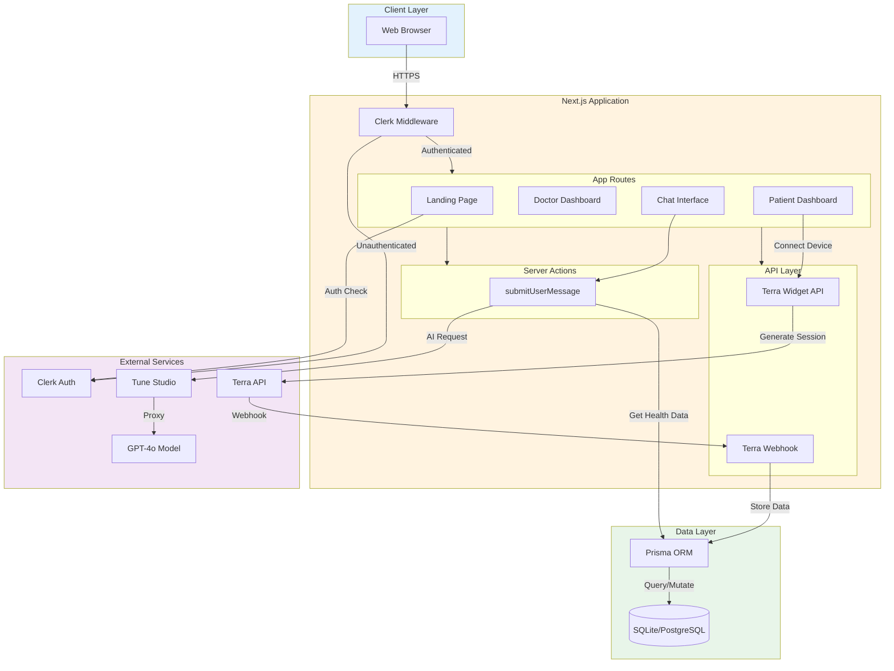

# TeddyCare Architecture

This document provides a comprehensive overview of TeddyCare's system architecture, design decisions, and technical implementation.

## Table of Contents

- [High-Level Overview](#high-level-overview)
- [Architecture Diagram](#architecture-diagram)
- [Core Components](#core-components)
- [Data Flow](#data-flow)
- [Authentication & Authorization](#authentication--authorization)
- [Health Data Integration](#health-data-integration)
- [AI Chat System](#ai-chat-system)
- [Database Architecture](#database-architecture)
- [Deployment Architecture](#deployment-architecture)
- [Security Considerations](#security-considerations)
- [Performance Optimizations](#performance-optimizations)
- [Design Decisions](#design-decisions)

## High-Level Overview

TeddyCare is a full-stack healthcare application built on Next.js 14 with the following key characteristics:

- **Framework**: Next.js 14 with App Router
- **Rendering**: Hybrid (Server-Side Rendering + Client Components)
- **Authentication**: Clerk with organization-based RBAC
- **AI**: Custom fine-tuned GPT-4o via Tune Studio
- **Health Data**: Terra API integration for wearables
- **Database**: Prisma ORM with SQLite (dev) / PostgreSQL (prod)

### Technology Stack

```
Frontend Layer:
├── Next.js 14 (React 18)
├── Tailwind CSS
├── shadcn/ui (Radix UI)
└── Framer Motion

Backend Layer:
├── Next.js API Routes
├── Server Actions
├── Prisma ORM
└── SQLite/PostgreSQL

External Services:
├── Clerk (Authentication)
├── Tune Studio (AI)
├── Terra API (Health Data)
└── Vercel (Hosting)
```

## Architecture Diagram



## Core Components

### 1. Application Shell

**Location**: `app/layout.tsx`

The root layout wraps the entire application and provides:
- Global styles and fonts
- Theme provider (light/dark mode)
- Clerk authentication wrapper
- Conditional rendering based on auth state

```tsx
// Simplified structure
<ClerkProvider>
  <Providers theme>
    <SignedIn>
      <Header />
      <main>{children}</main>
    </SignedIn>
    <SignedOut>
      <SignIn />
    </SignedOut>
  </Providers>
</ClerkProvider>
```

### 2. Middleware

**Location**: `middleware.ts`

Handles authentication before requests reach the application:
- Validates Clerk session
- Protects routes
- Extracts user organization info

### 3. Role-Based Dashboards

**Doctor Dashboard** (`app/doctor/`):
- Patient list with search
- Appointment schedule
- Urgent medical alerts
- Patient detail pages with health records

**Patient Dashboard** (`app/patient/`):
- Health metrics visualization
- Device connection (Terra Widget)
- Medical alerts
- Health tips

### 4. Chat System

**Location**: `app/chat/`, `lib/chat/actions.tsx`

Server-side AI chat implementation using:
- Vercel AI SDK for streaming
- React Server Components
- Server Actions for mutations

### 5. Health Data Integration

**Location**: `app/api/terra/`

Two main endpoints:
1. Widget session generation (for OAuth flow)
2. Webhook handler (for receiving data)

## Data Flow

### Authentication Flow

```
User Visit
    ↓
Middleware Check
    ↓
    ├──→ Not Authenticated ──→ Redirect to Clerk Sign-In
    │                               ↓
    │                          User Signs In
    │                               ↓
    └──← Session Created ←──────────┘
         ↓
    Check Organization
         ↓
    ├──→ Doctor Org ──→ /doctor
    └──→ Patient Org ──→ /patient
```

### Health Data Flow

```
Patient Dashboard
    ↓
Click "Connect Device"
    ↓
API: Generate Widget Session
    ↓
Terra OAuth Flow
    ↓
Device Connected
    ↓
Terra Syncs Data
    ↓
Webhook: Receive Data
    ↓
Validate Signature
    ↓
Store in Database (Prisma)
    ↓
Available for AI Chat
```

### AI Chat Flow

```
User Types Message
    ↓
Submit via Server Action
    ↓
Server: Get User Session (Clerk)
    ↓
Server: Fetch Health Data (Prisma)
    ↓
Server: Build Context
    ↓
Server: Call Tune Studio API
    ↓
Tune Studio → OpenAI GPT-4o
    ↓
Stream Response Back
    ↓
Client: Display Message
```

## Authentication & Authorization

### Clerk Implementation

TeddyCare uses Clerk's **organization feature** for role-based access control:

```typescript
// Role determination
const session = await auth();
const role = session.orgSlug; // 'doctor' or 'patient'

// Route protection (in layout)
if (slug !== 'doctor') {
  redirect('/');
}
```

### Organization Structure

```
Clerk Application
├── Doctor Organization (slug: "doctor")
│   ├── Doctor User 1
│   ├── Doctor User 2
│   └── ...
└── Patient Organization (slug: "patient")
    ├── Patient User 1
    ├── Patient User 2
    └── ...
```

### Permissions Model

| Role | Access |
|------|--------|
| Doctor | `/doctor/*`, `/chat`, Patient health data |
| Patient | `/patient/*`, `/chat`, Own health data |
| Unauthenticated | `/` (landing page), Clerk sign-in |

## Health Data Integration

### Terra API Architecture

```
Patient Device
    ↓
Terra SDK/App
    ↓
Terra Cloud
    ↓ (Webhook)
TeddyCare API
    ↓
Database
```

### Webhook Processing

1. **Receive**: POST request from Terra
2. **Verify**: Check signature header
3. **Parse**: Extract user ID and data type
4. **Store**: Save to database as JSON string
5. **Respond**: Return 200 OK

### Data Storage Strategy

Health data is stored as JSON strings in the database:

**Pros**:
- Flexible schema (Terra adds new fields)
- Easy to store complex nested data
- Fast ingestion

**Cons**:
- Harder to query specific fields
- No built-in validation

**Future Consideration**: Parse and normalize critical fields into separate columns for easier querying.

## AI Chat System

### Architecture

```
Chat UI (Client)
    ↓
Server Action
    ↓
├─→ Get User Context (Clerk)
├─→ Fetch Health Data (Prisma)
├─→ Build System Prompt
└─→ Call Tune Studio API
    ↓
Stream Response via RSC
    ↓
Display in UI
```

### System Prompt Strategy

The AI behavior changes based on user role:

**Doctor Mode**:
- Technical medical terminology
- Treatment suggestions
- Access to patient data via metadata

**Patient Mode**:
- Layman-friendly language
- Health advice and guidance
- Access to own health data

### Streaming Implementation

Uses Vercel AI SDK's `streamUI` for real-time responses:

```typescript
const result = await streamUI({
  model: openai('rohan/tune-gpt-4o'),
  system: systemPrompt,
  messages: conversationHistory,
  text: ({ content, done }) => {
    // Stream handler
  }
});
```

## Database Architecture

### Schema

```prisma
model TerraData {
  id        String   @id @default(cuid())
  userId    String
  type      String
  data      String   // JSON
  createdAt DateTime @default(now())
}
```

### Indexes

Consider adding indexes for production:

```prisma
@@index([userId])
@@index([type])
@@index([createdAt])
@@index([userId, type, createdAt])
```

### Query Patterns

```typescript
// Get latest data by type
const latest = await prisma.terraData.findMany({
  where: { userId, type: 'body' },
  orderBy: { createdAt: 'desc' },
  take: 1
});

// Get data in date range
const rangeData = await prisma.terraData.findMany({
  where: {
    userId,
    createdAt: {
      gte: startDate,
      lte: endDate
    }
  }
});
```

## Deployment Architecture

### Development

```
Local Machine
├── Next.js Dev Server (:3000)
├── SQLite Database (file:./dev.db)
└── ngrok (for Terra webhooks)
```

### Production (Vercel)

```
Vercel Edge Network
    ↓
Next.js Server (Serverless Functions)
    ↓
├─→ Clerk Auth
├─→ Tune Studio API
├─→ Terra API
└─→ PostgreSQL (Vercel Postgres/Supabase)
```

### Environment-Specific Configuration

| Feature | Development | Production |
|---------|-------------|------------|
| Database | SQLite | PostgreSQL |
| Webhooks | ngrok tunnel | Direct HTTPS |
| Logging | Console | Structured logging |
| Error Tracking | Console | Sentry/LogRocket |

## Security Considerations

### Authentication Security

- ✅ Clerk handles password hashing and session management
- ✅ JWT tokens for stateless auth
- ✅ Middleware protects all routes
- ✅ Organization-based access control

### API Security

- ✅ Terra webhook signature verification
- ✅ HTTPS in production
- ✅ Environment variables for secrets
- ⚠️ No rate limiting (rely on upstream services)
- ⚠️ No request size limits

### Data Security

- ✅ Health data encrypted at rest (database level)
- ✅ HTTPS for data in transit
- ✅ User isolation via userId checks
- ⚠️ Consider HIPAA compliance for production

### Recommended Additions

1. **Rate Limiting**: Implement at API route level
2. **Request Validation**: Use Zod for all API inputs
3. **Audit Logging**: Log all data access
4. **Error Handling**: Don't expose sensitive info in errors

## Performance Optimizations

### Current Optimizations

1. **Server Components**: Reduce client JavaScript
2. **Dynamic Imports**: Code splitting for heavy components
3. **Image Optimization**: Next.js automatic image optimization
4. **Streaming**: AI responses stream in real-time
5. **Edge Middleware**: Fast auth checks

### Recommended Additions

1. **Caching**: 
   - Redis for frequently accessed health data
   - SWR/React Query for client-side caching

2. **Database**:
   - Connection pooling (PgBouncer for PostgreSQL)
   - Read replicas for heavy read operations

3. **CDN**:
   - Static assets via Vercel Edge Network
   - API responses caching where appropriate

4. **Monitoring**:
   - Vercel Analytics
   - Performance monitoring (Web Vitals)
   - Database query performance

## Design Decisions

### Why Next.js 14?

- Server Components reduce client bundle size
- App Router provides better developer experience
- Built-in API routes eliminate need for separate backend
- Excellent Vercel deployment integration

### Why Clerk for Auth?

- Organization feature perfect for role-based access
- Handles complex auth flows (OAuth, MFA, etc.)
- Production-ready security
- Great developer experience

### Why Terra API?

- Widest device compatibility (80+ integrations)
- Healthcare-specific features
- Reliable webhook delivery
- Good documentation

### Why Tune Studio?

- Easy access to fine-tuned models
- OpenAI-compatible API
- Cost-effective for custom models
- Good latency

### Why SQLite (Dev) / PostgreSQL (Prod)?

- SQLite: Zero configuration for local development
- PostgreSQL: Production-grade for scale and features
- Prisma abstracts the differences
- Easy to switch between them

### Trade-offs

| Decision | Pros | Cons |
|----------|------|------|
| Storing JSON data | Flexible, fast ingestion | Harder to query, no validation |
| Server Components | Better performance | More complex debugging |
| Organization-based roles | Simple implementation | Less flexible than custom RBAC |
| Single database table | Simple schema | May need normalization later |

## Future Enhancements

### Short Term

1. Add proper error boundaries
2. Implement request validation
3. Add loading states and skeletons
4. Improve mobile responsiveness

### Medium Term

1. Add data visualization (charts for health metrics)
2. Implement appointment scheduling
3. Add push notifications
4. Create admin dashboard

### Long Term

1. Multi-tenancy for healthcare providers
2. Integration with EHR systems
3. Telemedicine video calls
4. Prescription management
5. HIPAA compliance certification

## Related Documentation

- [Main README](README.md)
- [Setup Guide](SETUP.md)
- [API Documentation](API.md)
