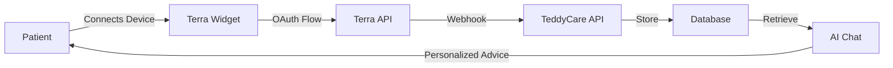

# TeddyCare

<p align="center">
  
</p>

<p align="center">
  An AI-powered healthcare assistant that connects doctors and patients with personalized health insights.
</p>

<p align="center">
  <a href="https://teddycare.vercel.app/">
    <strong>View Demo</strong>
  </a>
</p>

---

## Overview

TeddyCare is a Next.js-based healthcare platform that leverages AI to provide personalized medical assistance. It features role-based dashboards for both doctors and patients, integrates with health tracking devices through Terra API, and uses a custom fine-tuned GPT-4o model for medical conversations.

## Key Features

- **Dual User Roles**: Separate dashboards for doctors and patients with role-based routing
- **AI-Powered Chat**: Custom fine-tuned OpenAI model (`rohan/tune-gpt-4o`) trained for healthcare conversations
- **Health Data Integration**: Connect wearable devices and health trackers via Terra API
- **Real-time Health Monitoring**: Track vital signs, sleep patterns, and other health metrics
- **Secure Authentication**: Clerk-based authentication with organization-level access control
- **Modern UI**: Built with Next.js 14, React Server Components, and Tailwind CSS

## Tech Stack

- **Framework**: [Next.js 14](https://nextjs.org) with App Router
- **AI**: [Vercel AI SDK](https://sdk.vercel.ai) with custom fine-tuned OpenAI model via [Tune Studio](https://tune.studio)
- **Authentication**: [Clerk](https://clerk.com) with organization-based role management
- **Database**: [Prisma](https://prisma.io) with SQLite (development) / PostgreSQL (production)
- **Health Data**: [Terra API](https://tryterra.co) for wearable device integration
- **UI Components**: [shadcn/ui](https://ui.shadcn.com) with [Radix UI](https://radix-ui.com)
- **Styling**: [Tailwind CSS](https://tailwindcss.com)

## Prerequisites

Before you begin, ensure you have the following installed and configured:

- **Node.js** 18.x or later
- **pnpm** 8.6.3 or later (this project uses pnpm as its package manager)
- **Clerk Account** with two organizations set up:
  - Organization with slug `doctor`
  - Organization with slug `patient`
- **Tune Studio Account** with API access
- **Terra API Account** for health data integration

## Getting Started

### 1. Clone the Repository

```bash
git clone https://github.com/ithons/TeddyCare.git
cd TeddyCare
```

### 2. Install Dependencies

This project uses **pnpm** as its package manager:

```bash
pnpm install
```

> **Note**: Do not use npm or yarn. The project is configured specifically for pnpm.

### 3. Set Up Environment Variables

Create a `.env` file in the root directory by copying the example:

```bash
cp .env.example .env
```

Then fill in the required values:

```bash
# Tune Studio API (OpenAI Proxy)
TUNE_STUDIO_API_KEY=your_tune_studio_api_key

# Clerk Authentication
NEXT_PUBLIC_CLERK_PUBLISHABLE_KEY=your_clerk_publishable_key
CLERK_SECRET=your_clerk_secret_key

# Terra API
TERRA_DEV_ID=your_terra_dev_id
TERRA_API_KEY=your_terra_api_key
TERRA_WEBHOOK_SECRET=your_terra_webhook_secret

# Database
DATABASE_URL="file:./dev.db"
```

#### Getting Your API Keys

- **Tune Studio**: Sign up at [tune.studio](https://tune.studio) and get your API key from [Account Settings](https://tune.studio/account/api-keys)
- **Clerk**: Create an account at [clerk.com](https://clerk.com), then:
  1. Create a new application
  2. Create two organizations: one with slug `doctor` and one with slug `patient`
  3. Copy your publishable key and secret key from the dashboard
- **Terra API**: Sign up at [tryterra.co](https://tryterra.co) and obtain your API credentials

### 4. Set Up the Database

Initialize the Prisma database:

```bash
pnpm run setup
```

This will:
- Install dependencies
- Generate Prisma client
- Create the SQLite database
- Push the schema to the database

### 5. Start the Development Server

```bash
pnpm dev
```

Open [http://localhost:3000](http://localhost:3000) in your browser.

## Project Structure

```
TeddyCare/
├── app/
│   ├── api/                    # API routes
│   │   └── terra/              # Terra API integration
│   │       ├── generateWidgetSession/  # Widget session endpoint
│   │       └── webhook/        # Terra webhook handler
│   ├── chat/                   # AI chat interface
│   ├── doctor/                 # Doctor dashboard pages
│   │   ├── patient-info/       # Individual patient views
│   │   ├── PatientList.tsx     # List of all patients
│   │   └── AppointmentList.tsx # Upcoming appointments
│   ├── patient/                # Patient dashboard pages
│   │   └── components/         # Patient-specific components
│   ├── layout.tsx              # Root layout with authentication
│   └── page.tsx                # Landing page with org selector
├── components/
│   ├── ui/                     # Reusable UI components (shadcn/ui)
│   ├── chat.tsx                # Main chat component
│   └── header.tsx              # Navigation header
├── lib/
│   ├── chat/                   # Chat-related utilities
│   │   ├── actions.tsx         # Server actions for AI chat
│   │   └── userData.ts         # Sample health data
│   └── hooks/                  # Custom React hooks
├── prisma/
│   └── schema.prisma           # Database schema
└── public/                     # Static assets
```

## User Roles and Access Control

TeddyCare uses Clerk's organization feature for role-based access control:

### Doctor Role
- Access the doctor dashboard at `/doctor`
- View list of all patients
- Access individual patient health records
- Chat with AI for medical advice with access to patient data

### Patient Role
- Access the patient dashboard at `/patient`
- Connect health tracking devices via Terra Widget
- View personal health metrics and trends
- Chat with AI for health guidance

**Role Assignment**: Users are assigned roles based on which Clerk organization they belong to:
- Members of the `doctor` organization → Doctor access
- Members of the `patient` organization → Patient access

## How It Works

### Authentication Flow

1. User signs in via Clerk
2. Middleware checks user's organization membership
3. User is redirected to appropriate dashboard based on organization slug

### Health Data Integration



1. Patient connects their wearable device through Terra Widget
2. Terra API authenticates and begins syncing health data
3. Webhooks send health data to TeddyCare's API endpoint
4. Data is stored in the database via Prisma
5. AI chat system accesses health data to provide personalized medical advice

### AI Chat System

The chat uses a custom fine-tuned GPT-4o model (`rohan/tune-gpt-4o`) accessed through Tune Studio's proxy. The system prompt adapts based on user role:

- **For Doctors**: Provides technical medical information and treatment suggestions
- **For Patients**: Offers health advice in accessible language with diagnostic support

## Available Scripts

```bash
# Development
pnpm dev              # Start development server
pnpm build            # Build for production
pnpm start            # Start production server

# Database
pnpm setup            # Initial setup (install, generate, db push)
pnpm db:studio        # Open Prisma Studio
pnpm db:reset         # Reset database (WARNING: deletes all data)

# Code Quality
pnpm type-check       # Run TypeScript type checking
pnpm format:write     # Format code with Prettier
pnpm format:check     # Check code formatting

# Utilities
pnpm clean            # Remove .next and node_modules
```

## Deployment

### Deploy to Vercel

1. Push your code to GitHub
2. Import your repository in [Vercel](https://vercel.com)
3. Configure environment variables in Vercel dashboard
4. Deploy

**Important**: For production, switch from SQLite to PostgreSQL:
- Add a PostgreSQL database (e.g., Vercel Postgres, Supabase)
- Update `DATABASE_URL` in your environment variables

### Environment Variables for Production

Ensure all environment variables from `.env.example` are configured in your hosting platform.

## Contributing

Contributions are welcome! Please follow these guidelines:

1. Fork the repository
2. Create a feature branch (`git checkout -b feature/amazing-feature`)
3. Commit your changes (`git commit -m 'Add amazing feature'`)
4. Push to the branch (`git push origin feature/amazing-feature`)
5. Open a Pull Request

## License

This project is licensed under the MIT License. See the [LICENSE](LICENSE) file for details.

## Support

For questions or issues:
- Open an issue on GitHub
- Check existing documentation in `/docs`
- Review the [Setup Guide](SETUP.md) for detailed configuration instructions

## Acknowledgments

- Built with [Next.js](https://nextjs.org)
- UI components from [shadcn/ui](https://ui.shadcn.com)
- AI powered by [OpenAI](https://openai.com) via [Tune Studio](https://tune.studio)
- Health data from [Terra API](https://tryterra.co)
- Authentication by [Clerk](https://clerk.com)

---

<p align="center">Made with ❤️ for better healthcare</p>
